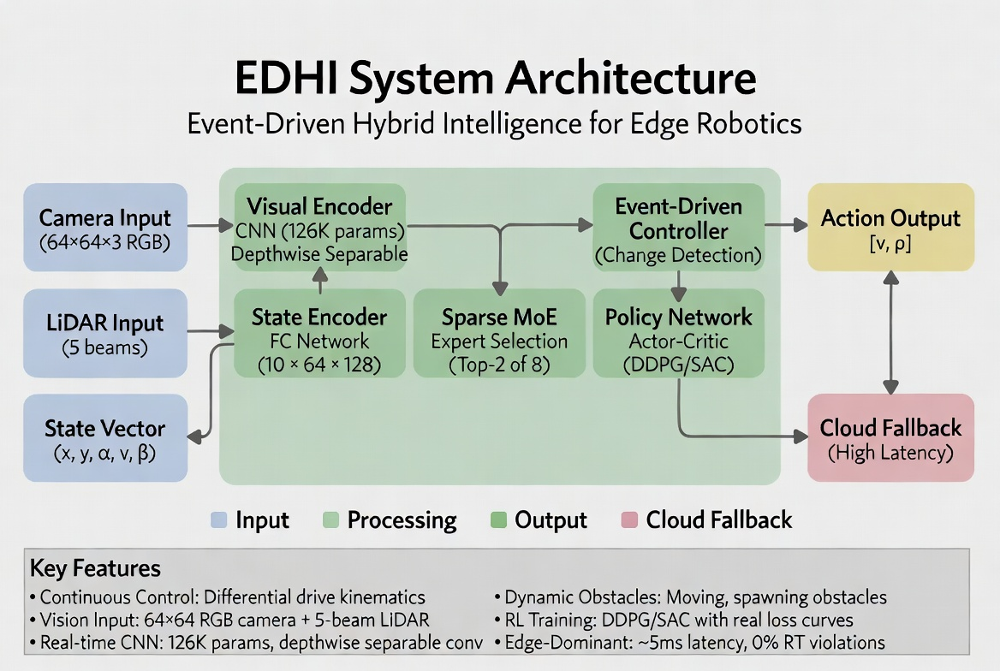

  <h1 align="center">Edge Dominant Hierarchical Intelligence (EDHI)</h1>
  

    Real-Time • Edge-Native • Hierarchical AI Architecture for Autonomous Systems
  

  
  
  
  

<strong>
Deterministic, Low-Latency Intelligence Architecture for Real-World Autonomous Systems
</strong>

---

<h2>System Architecture Overview</h2>

  

Event-Driven Hybrid Intelligence Pipeline for Edge Robotics

---

<h2>Overview</h2>

Edge Dominant Hierarchical Intelligence (EDHI) is an open-source framework engineered for
<strong>low-latency, energy-efficient, fully autonomous AI systems</strong> operating entirely at the edge.

<ul>
<li><strong>Perception</strong> — sensor fusion, semantic understanding</li>
<li><strong>Planning</strong> — decision-making, trajectory generation</li>
<li><strong>Control</strong> — real-time actuation and feedback stabilization</li>
</ul>

EDHI enforces <strong>deterministic execution, local intelligence, and cross-layer feedback coupling</strong>,
making it suitable for real-world autonomous systems where latency and reliability are critical.

---

<h2>Why EDHI</h2>

<ul>
<li><strong>Traditional ROS Pipelines</strong> → loosely coupled, unpredictable latency</li>
<li><strong>Cloud AI Systems</strong> → high latency, network dependency</li>
<li><strong>EDHI</strong> → deterministic, edge-native, tightly integrated intelligence</li>
</ul>

---

<h2>Core Architecture</h2>

<pre>
+-----------------------------+
|        Planning Layer       |
|  Task reasoning, policies   |
+-------------+---------------+
              ↓
+-----------------------------+
|      Perception Layer       |
|  Sensor fusion, semantics   |
+-------------+---------------+
              ↓
+-----------------------------+
|       Control Layer         |
|  Actuation, feedback loops  |
+-----------------------------+
</pre>

<table>
<tr><th>Layer</th><th>Frequency</th><th>Responsibility</th></tr>
<tr><td>Perception</td><td>10–60 Hz</td><td>Scene understanding, state estimation</td></tr>
<tr><td>Planning</td><td>1–10 Hz</td><td>Task decisions, trajectory generation</td></tr>
<tr><td>Control</td><td>100–1000 Hz</td><td>Motor commands, stabilization</td></tr>
</table>

---

<h2>Execution Model</h2>

<pre>
Control Loop      : 100–1000 Hz (hard real-time)
Perception Loop   : 10–60 Hz   (soft real-time)
Planning Loop     : 1–10 Hz    (asynchronous)
</pre>

<ul>
<li>Priority-based scheduling</li>
<li>Zero-copy communication pipelines</li>
<li>Deterministic latency guarantees</li>
</ul>

---

<h2>System Guarantees</h2>

<ul>
<li><strong>Bounded Latency</strong> — deterministic perception-to-control pipeline</li>
<li><strong>Edge Autonomy</strong> — zero dependency on external infrastructure</li>
<li><strong>Graceful Degradation</strong> — cloud fallback without system failure</li>
<li><strong>Real-Time Safety</strong> — prioritized control loop execution</li>
</ul>

---

<h2>System Flow</h2>

<pre>
Sensors → Perception → World Model → Planner → Controller → Actuators
                ↑            ↓             ↑
                +------------+-------------+
                   Feedback and State Sync
</pre>

---

<h2>Module Breakdown</h2>

<strong>Perception Engine</strong>
<ul>
<li>Multi-modal fusion (RGB, Depth, IMU, LiDAR)</li>
<li>State estimation (EKF, factor graphs)</li>
<li>Semantic understanding</li>
</ul>

<strong>World Model</strong>
<ul>
<li>Dynamic environment representation</li>
<li>Spatial + semantic fusion</li>
</ul>

<strong>Planning Engine</strong>
<ul>
<li>Hierarchical planning (task + motion)</li>
<li>Policy-based decision systems</li>
</ul>

<strong>Control Engine</strong>
<ul>
<li>Whole-body control (WBC)</li>
<li>Model Predictive Control (MPC)</li>
<li>Real-time stabilization</li>
</ul>

<strong>Runtime Orchestrator</strong>
<ul>
<li>Task scheduling</li>
<li>Low-latency IPC</li>
<li>Resource allocation</li>
</ul>

---

<h2>Key Differentiators</h2>

<ul>
<li>Edge-first intelligence (no cloud dependency)</li>
<li>Hierarchical closed-loop architecture</li>
<li>Cross-layer feedback integration</li>
<li>Hardware-aware inference optimization</li>
<li>Deterministic execution guarantees</li>
</ul>

---

<h2>Target Applications</h2>

<ul>
<li>Humanoid robotics (locomotion + manipulation)</li>
<li>Autonomous mobile robots</li>
<li>Industrial automation systems</li>
<li>Edge AI drones</li>
<li>Assistive robotics platforms</li>
</ul>

---

<h2>Technology Stack</h2>

<table>
<tr><th>Component</th><th>Support</th></tr>
<tr><td>Languages</td><td>C++, Python</td></tr>
<tr><td>Middleware</td><td>ROS2, custom runtime</td></tr>
<tr><td>AI Frameworks</td><td>PyTorch, TensorFlow Lite, ONNX</td></tr>
<tr><td>Acceleration</td><td>CUDA, TensorRT, OpenVINO</td></tr>
<tr><td>OS</td><td>Linux, PREEMPT-RT</td></tr>
</table>

---

<h2>Repository Structure</h2>

<pre>
edhi/
 ├── docs/
 │    └── architecture.png
 ├── perception/
 ├── planning/
 ├── control/
 ├── runtime/
 ├── models/
 ├── scripts/
 └── examples/
</pre>

---

<h2>Installation</h2>

<pre>
git clone https://github.com/udaypythondeveloper/Edge-Dominant-Hierarchical-Intelligence-EDHI-.git
cd Edge-Dominant-Hierarchical-Intelligence-EDHI-

./scripts/setup.sh

mkdir build && cd build
cmake ..
make -j$(nproc)
</pre>

---

<h2>Quick Start</h2>

<pre>
./bin/perception_node
./bin/planner_node
./bin/controller_node

./scripts/run_full_stack.sh
</pre>

---

<h2>Performance Targets</h2>

<table>
<tr><th>Metric</th><th>Target</th></tr>
<tr><td>Latency</td><td>&lt; 10–20 ms</td></tr>
<tr><td>Control Frequency</td><td>Up to 1 kHz</td></tr>
<tr><td>Power</td><td>&lt; 50W</td></tr>
<tr><td>Reliability</td><td>Fault-tolerant autonomy</td></tr>
</table>

---

<h2>Roadmap</h2>

<ul>
<li>Unified world model API</li>
<li>Multi-robot coordination</li>
<li>Learning-based control integration</li>
<li>Digital twin simulation</li>
<li>Safety-critical verification</li>
</ul>

---

<h2>Contribution</h2>

<ol>
<li>Fork repository</li>
<li>Create feature branch</li>
<li>Commit with documentation</li>
<li>Submit pull request</li>
<li>Ensure all tests pass</li>
</ol>

---

<h2>License</h2>

MIT License

---

<h2>Vision</h2>

<ul>
<li>Local intelligence (no cloud dependency)</li>
<li>Hierarchical system design</li>
<li>Deterministic execution</li>
</ul>

<strong>Goal: General-purpose autonomous machines operating reliably in real-world environments.</strong>

